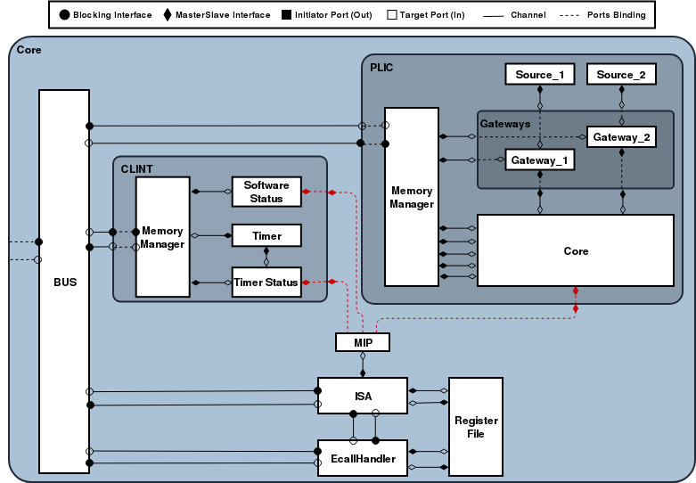

This README gives an overview of the RISC-V with interrupts handler implementation and the process to generate some testing examples including FreeRTOS.

**Content:**

* **Documentation**: includes RISC-V Instruction Set Manual (Volume I: User-Level ISA, Volume II: Privileged Architecutre) and some presentations that help understand the architecture of the RISC-V processor.
* **Examples**: a collection of assembly and c++ programs to test the implementation and some programs with interrupts handling functions, including one example of FreeRTOS operating system.
* **ESL**: includes the Electronic system level description of the RISC-V core.
* **RTL**: RTL Design of the RISC-V Processor as well as Test Benches
* **ITL**: ITL properties to formaly verify the correctness of the RTL design.
* **SVA**: SVA properties to formaly verify the correctness of the ISA module of the RTL design.

# Electronic System Level (ESL):

Following the rules of SystemC-PPA (more details can be found [here](https://github.com/ludwig247/DeSCAM)) and in compliance with SiFive (more details can be found [here](//www.sifive.com/core-designer)) guidelines regarding the structure and memory mapping of RISCV processor, we created our complex system-level design for a RISCV processor with interrupts handling, as shown in following figure. We will briefly describe the modules and sub-modules created for this design and the communication channels used between them.

### ISA:
The main module of the core, it handles all the control and arithmetic executions in the core. It communicates with other modules through the following ports:

- **blocking_out <CUtoME_IF> toMemoryPort** used for request a read instruction, request a read data for load instructions and request a write data for store instructions.
- **blocking_in<MEtoCU_IF> fromMemoryPort** used for read instruction and read data for load instructions.
- **master_in<RegfileType> fromRegsPort** used for reading the register file.
- **master_out<RegfileWriteType> toRegsPort** used for writing back to the register file.
- **blocking_out<bool> isa_ecall_Port** used for triggering the EcallHandler when an ECALL is read. This communication has to be through a Blocking channel in order to suspend execution of ISA while the ECALL is being served.
- **blocking_in<bool> ecall_isa_Port** used for reading the status of the processor after ECALL. This status might trigger the end of simulation for system-level model when the environment call served is \textit{exit}.
- **master_in<unsigned int> mip_isa_Port** used for reading the status of the connected interrupt sources.

The sequence of communications with other modules differ depending on the instruction being executed. These instructions can be categorized according to their encryption type. Table \ref{table:riscv_isaComm} shows the sequence of communications for all possible encryption types following the pair of communication to read an instruction from memory.

|   |   |   |   |   |   |
|------|:------:|:------:|:------:|:------:|:------:|
| *R_Type* | RF_read | ... | ... | RF_write | ... | MIP_read |
| *B_Type* | RF_read | ... | ... | ... | ... | MIP_read |
| *S_Type* | RF_read | ... | **MEM_write** | ... | ... | MIP_read |
| *U_Type* | ... | ... | ... | RF_write | ... | MIP_read |
| *J_Type* | ... | ... | ... | RF_write | ... | MIP_read |
| *I_I_Type* | RF_read | ... | ... | RF_write | ... | MIP_read |
| *I_L_Type* | RF_read | ... | **MEM_read** | RF_write | ... | MIP_read |
| *I_J_Type* | RF_read | ... | ... | ... | ... | MIP_read |
| *I_S_Type 1* | RF_read | ... | ... | RF_write | ... | MIP_read |
| *I_S_Type 2* | ... | ... | ... | RF_write | ... | MIP_read |
| *I_S_Type 3* (ECALL) | ... | ... | ... | ... | **EcallHandler** | MIP_read |
| *I_S_Type 3* | ... | ... | ... | ... | ... | MIP_read |

### Register File:
This module will always present the content of the register file to the connected modules (ISA and EcallHandler) by using *slave_out* ports. It will also keep on checking both inward ports for writing requests. It has the following communication ports:

- **slave_in<RegfileWriteType> toRegsPort** used for reading a write request from ISA to a certain register in the register file.
- **slave_out<RegfileType> fromRegsPort** used for exporting the entire register file to ISA.
- **slave_in<RegfileWriteType> ecall_reg_Port** used for reading a write request from EcallHandler to register (*x10*) in the register file.
- **slave_out<RegfileEcallType> reg_ecall_Port** used for exporting registers (*x10*, *x11*, *x12* and *x17*) to EcallHandler.

### Environment call handler:
This module is responsible for executing environment requests from the running program. These request may include many types, but in our current implementation we are only supporting both (*printf* and *exit*). It has the following communication ports:

- **blocking_out<CUtoME_IF> toMemoryPort** used for requesting a read of memory content.
- **blocking_in<MEtoCU_IF> fromMemoryPort** used for reading data from the memory.
- **master_in<RegfileEcallType> reg_ecall_Port** used for reading registers (*x10*, *x11*, *x12* and *x17*) which should be holding the arguments and type of ecall request.
- **master_out<RegfileWriteType> ecall_reg_Port** used for writing back to the register file (specifically to *x10*, which should hold the result of an ecall request).
- **blocking_out<bool> ecall_isa_Port** used for returning to ISA the status of the processor after handling the ecall.
- **blocking_in<bool> isa_ecall_Port** used for triggering the main process of the EcallHandler by ISA.

### Pending machine interrupt handler:
This module is responsible for collecting the interrupts statuses (In our current implementation we are only supporting system, timer and external interrupts), and present them to ISA as a single 32-bit value (`mip` register of CSRs) with each bit referring to a specific interrupt source. It has the following communication ports:

- **slave_out<unsigned int> mip_isa_Port** used for writing the 32-bit value to ISA.
- **master_in<bool> MSIP_port** used for reading the status of system interrupt.
- **master_in<bool> MTIP_port** used for reading the status of timer interrupt.
- **master_in<bool> MEIP_port** used for reading the status of external interrupt.

### Core Local Interruptor (CLINT):
This module is used to generate software and timer Interrupts. It contains the RISC-V `msip`, `mtime` and `mtimecmp` memory mapped CSRs. The `msip` memory mapped CSR can be used to generate Machine Software Interrupts (MSIP). This register can be accessed by remote harts to provide machine-mode interprocessor interrupt (Not included in our current implementation). `mtime` and `mtimecmp` memory mapped CSRs can be used to generate Machine Timer Interrupts (MTIP). This interrupt is set when `mtime` exceed `mtimecmp` and it can be reset by writing a new bigger value to `mtimecmp`. This module has the following communication ports:

- **blocking_in<CUtoME_IF> COtoME_port** used for reading memory access requests from the Core.
- **blocking_out<MEtoCU_IF> MEtoCO_port** used for presenting the CLINT memory reply to the Core.
- **slave_out<bool> MSIP_port** used for presenting the MSIP status to the Core.
- **slave_out<bool> MTIP_port** used for presenting the MTIP status to the Core.

CLINT requires more than one thread to be running simultaneously and because currently SystemC-PPA doesn't support multiple threads, the internal of CLINT has been divided into submodules as shown in figure above.

### Platform Level Interrupt Controller (PLIC):
This module is used to prioritize and distribute global interrupts and generate on their behalf what is called the External Interrupt (MEIP). For every added external interrupt source, a new gateway should be added to the *PLIC_Gateways* to handle the interrupt type (i.e. Level triggered or edge triggered interrupts) and required register and channels to *PLIC_Core* and *PLIC_Memory_Manager* follows as well. This module has the following communication ports:

- **blocking_in<CUtoME_IF> COtoME_port** used for reading memory access requests from the Core.
- **blocking_out<MEtoCU_IF> MEtoCO_port** used for presenting the PLIC memory reply to the Core.
- **slave_out<bool> MEIP_port** used for presenting the MEIP status to the Core.

PLIC require more than one thread to be running simultaneously and because currently SystemC-PPA doesn't support multiple threads, the internal of PLIC have been divided into submodules as shown in figure above.

### CoreBus

This module is responsible for forwarding ISA and EcallHandler memory access requests and replies to the three connected memory mapped modules (CLINT, PLIC and Memory). It has the following communication ports:

- **blocking_in<CUtoME_IF> ecall_bus_Port** used for reading the EcallHandler memory access requests.
- **blocking_out<MEtoCU_IF> bus_ecall_Port** used for forwarding the memory reply to the EcallHandler.
- **blocking_in<CUtoME_IF> isa_bus_Port** used for reading the ISA memory access requests.
- **blocking_out<MEtoCU_IF> bus_isa_Port** used for forwarding the memory reply to the ISA.
- **blocking_out<CUtoME_IF> BUStoMEM_port** used for forwarding the Core memory access requests to Memory.
- **blocking_in<MEtoCU_IF> MEMtoBUS_port** used for reading the Memory reply.
- **blocking_out<CUtoME_IF> BUStoCLINT_port** used for forwarding the Core memory access requests to CLINT.
- **blocking_in<MEtoCU_IF> CLINTtoBUS_port** used for reading the CLINT reply.
- **blocking_out<CUtoME_IF> BUStoPLIC_port** used for forwarding the Core memory access requests to PLIC.
- **blocking_in<MEtoCU_IF> PLICtoBUS_port** used for reading the PLIC reply.

Adding new Peripherals will require adding two new communication ports to this module and manage the linking at the Core level.

### Core:
This module represent a Top model for the previously mentioned modules and it forwards the Memory connections outward of the Core for consistency purposes with other RISCV implementations presented in this project. It has the following communication ports:

- **blocking_out<CUtoME_IF> COtoME_port** used for forwarding the memory access request out of Core.
- **blocking_in<MEtoCU_IF> MEtoCO_port** used for forwarding the memory reply to the internal modules of the Core.

# Register Transfer Level (RTL):

Most of the ESL modules of the RISCV-Interrupt processor have been designed following SystemC-PPA methodology with the exception of some internal submodules in CLINT and PLIC which are considered as environmental components and not as parts of the main core or the RISCV processor. Starting from these ESL modules, a complete set of ITL properties have been generated for each sub-module using **SCAM** tool and later the RTL design of these sub-modules have been created while guaranteeing that the properties are holding. The only refinement needed of the properties was to modify the macros to match the RTL naming for ports and signals. No timing refinement was needed because this RISCV processor implementation was designed with single cycle processes. The tool used for verifying the ITL properties was **OneSpin**.

The RTL directory includes the VHDL implementation of the Core while ITL directory includes the set of ITL properties.

# Examples:

### Prerequisites
- In order to generated elf or hex programs for these examples you need to have a functioning RISCV compiler.
For more details about this look at the RISCV Compiler section.
- To make sure no mixing happens while generating the programs, add to your .bashrc file the following lines:

        export RISCV_XLEN=32
        export RISCV_LIB=elf
        export RISCV=/opt/riscv32i

- In order to run elf programs on this processor you need to have Boost library installed.

### FreeRTOS:

You can download this example from (https://github.com/illustris/FreeRTOS-RISCV).
The only functional change required to run this example on our processor is to modify the **configTICK_CLOCK_HZ** in (FreeRTOS/Demo/riscv-spike/conf/FreeRTOSConfig.h)
for timing purposes.
Another architectural change is required to insure consistency between our implementation's definition of Memory's addressing space and FreeRTOS addressing space,
this change happens at (FreeRTOS/Demo/riscv-spike/arch/link.ld):

    MEMORY {
    	imem : ORIGIN = 0x00000000, LENGTH = 0x00020000
    	dmem : ORIGIN = 0x00020000, LENGTH = 0x00020000
    }

In order to preserve consistency between all examples, regarding addressing space and used libraries, the architecture of the FreeRTOS example is used in all other
examples and only minor changes happen regarding interrupt handlers in the (arch/boot.S) file.

### PrintMessage:
This example has been constructed to test the functionality of the SYScallHandler be using the "printf" function in the program which triggers a syscall.
No interrupt has been enabled in this example.

### Timer:
This example has been constructed to test the functionality of the interrupt handling and interrupt triggering by CLINT.
Only timer interrupt has been enabled in this example.

### TempSensor:
This example has been constructed to test the functionality of the interrupt handling and prioritizing when two interrupt are being triggered. Timer interrupt and Local
interrupt, with local interrupt having a higher priority than timer interrupt.

The local interrupt source (Peripherals/CoreTempSensor) issues an interrupt when the current Temperature (Tcur) passes a certain threshold value (Tthreshold). The randomness of the
temperature value is being handled using SCV library. In order to incorporate the CoreTempSensor in the processor you should uncomment its pragma from Core:

    //#define CoreTempSensor_ON

All local0, external, timer and software interrupts have been enabled in this example but only local0 and timer will be really active.

## RISCV Compiler
You can download RISCV compiler from this link:
    https://github.com/cliffordwolf/picorv32#building-a-pure-rv32i-toolchain

The default settings in the riscv-tools build scripts will build a compiler,
assembler and linker that can target any RISC-V ISA, but the libraries are built
for RV32G and RV64G targets. Follow the instructions below to build a complete toolchain
(including libraries) that target a pure RV32I CPU.

- Ubuntu packages needed:

        sudo apt-get install autoconf automake autotools-dev curl libmpc-dev \
        libmpfr-dev libgmp-dev gawk build-essential bison flex texinfo \
        gperf libtool patchutils bc zlib1g-dev libexpat-dev git

The following commands will build the RISC-V GNU toolchain and libraries for a pure RV32I target,
and install it in /opt/riscv32i:

    sudo mkdir /opt/riscv32i
    sudo chown $USER /opt/riscv32i

    git clone https://github.com/riscv/riscv-gnu-toolchain riscv-gnu-toolchain-rv32i
    cd riscv-gnu-toolchain-rv32i
    git checkout 1b80cbe
    git submodule update --init --recursive

    ./configure --prefix=/opt/riscv32i --with-arch=rv32i --with-abi=ilp32
    make -j$(nproc)

**NOTE**: don't forget to add /opt/riscv32i/bin to your PATH variable in your .bashrc file

The commands will all be named using the prefix riscv32-unknown-elf-, which makes it
easy to install them side-by-side with the regular riscv-tools (those are using the name
prefix riscv64-unknown-elf- by default).
