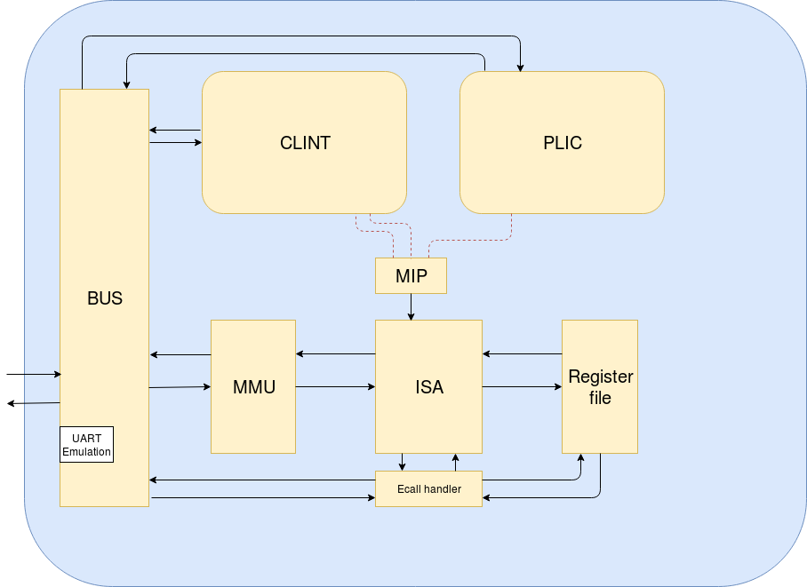
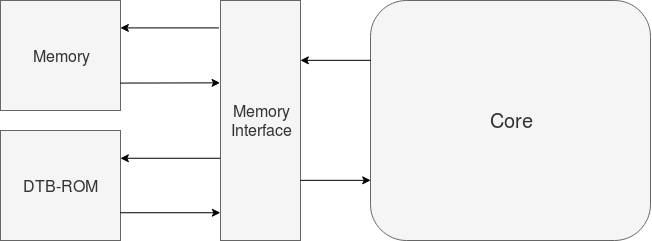

This README gives an overview of the extensions made to the RISC-V with interrupts, located under SCAM/example/RISCV_interrupts. These extensions
are; S and U privilege levels, A extension and MMU. It also includes directions on how to test the architecture with the same tests used in
RISC-V compliance testing for testing virtual machines. 

**Content:**
- *Documentation*: Contains RISC-V Instruction Set Manual (Volume I: User-Level ISA, Volume II: Privileged Architecture), Buildroot manual and Device tree
  specification-v0.2.
- *Environment*: Contains files to compile the framework to test the processor.
- *ESL*: Electronic system level description of the RISC-V processor.
- *Linux*: Contains the device tree specification file, an example bootloader and newest version of Buildroot.
- *riscv-tests*: Contains precompiled tests that checks if architecture complies with RISC-V specification
- *RTL*: Contains properties and RTL skeleton for entire CPU produced by deSCAM.

#Electronic System Level (ESL)

To implement privilege levels on the RISCV_interrupts project, a number of instructions, functions and CSR's has been added to handle traps correctly
and to make the processor more compliant with the RISC-V specifications. The flow of this extension is as follows.
- 1:Any pending interrupt is stored in a register using the interrupt identification code. 
- 2:Which privilege level handles the trap is determined using delegation CSR's.
- 3:Generic trap value, cause and vector address registers are computed and used to aid in delegation.
- 4:Appropriate trap value, cause and vector address CSR's are updated using the generic registers.
- 5:Program counter, mstatus and privilege level is updated. 

In the event of an exception and interrupt occuring in the same instruction, the exception trap handler is the one that gets
executed to ensure exception gets handled. Any interrupt will still be pending on return.

Exceptions are handled using a register storing the exception code and a flag analogous to the interrupt flag in the cause register. 
The exception flag is invisible outside the implementation. When an instruction raises an exception this exception flag signals that
no registers should be written and that MMU should only return received exception code. Any other implementation results in a vast 
increase of properties. Any exception occuring within MMU terminates translation and exception code is returned. 

### Register File:
Modified so register is not written if an instruction generates an exception.

### SyscallHandler:
Not modified but never used. The test suite requires ECALL to raise an exception, where SW handles the call. This hardware block remains in 
the core to ease any future implementation of hardware interception of exceptions. 

### Memory Management Unit (MMU):
This module stands as an interface between the ISA module and BUS and translates memory addresses using Sv32 page based virtual memory. 
It has the following communication ports:
- *blocking_in<MMU_in> isa_mmu* used for receiving the memory access request from ISA.
- *blocking_out<MMU_return> mmu_isa* used for returning the memory data or exception code to ISA.
- *blocking_in<MEtoCU_IF> mem_mmu* used for receiving memory data from memory.
- *blocking_out<CUtoME_IF> mmu_mem* used for sending memory access request to memory using physical address.

Sv32 memory translation allows for 34-bit physical addresses. In this implementation the upper two bits
are hardwired to zero to restrict physical addressing range to 32-bits. This is legal according to specification.
The MMU module uses an internal page table walker, translation lookaside buffer is not implemented.

Any access to memory is checked against the implementations physical memory attributes (PMA):
RAM: Allowed privilege and access type determined by page table entry.
ROM: Allowed access by machine mode privilege, store access type not allowed.
UART: Allowed access by machine mode privilege (System calls to write/read uart is handled by M-mode SW).
CLINT: Allowed access by machine mode privilege.
PLIC: Allowed access by machine mode privilege.
Any other address range raises access fault exception 

### Atomic Instructions Extension (A):
The atomic intruction extension as it stands is only suitable for a single hart system, but is easily extended to multi hart.
Load reserved (LR) puts a reservation on a physical address by storing it in a register in MMU, any new LR invalidates/overwrites
this address so the LR/SC stack need only be one deep. Store conditional (SC) is only successful if the address matches the address of the latest LR.
For this to function properly in a multicore system a common monitor slave module can be implemented. The MMU of each hart communicates
their memory accesses and LR/SC operations to this module.

The remaining atomic instructions can lock a common bus on entry, and unlock it on exit. This implies any hart needs to check if bus is locked
and stall if so for any instruction requiring bus access. 

#Environment: 

The environment the RISC-V code runs on can be built in the subfolder Environment using cmake. 
*Core_test.h* binds the Core to the memory interface, and the memory interface to memory and dtb_rom.

# riscv-tests

### Prerequisites 
Only Boost library pagackes if using the provided precompiled riscv-tests.

To download and compile full test suite:
Make sure that the RISCV environment variable is set to the RISC-V tools
install path, and that the riscv-gnu-toolchain package is installed.

    $ git clone https://github.com/riscv/riscv-tests
    $ cd riscv-tests
    $ git submodule update --init --recursive
    $ autoconf
    $ ./configure --prefix=$RISCV/target
    $ make
    $ make install

### Tests

The tests are designed to check that the hardware it runs on is made according to the RISC-V specifications. 

The *rv32xx-p* tests are all run with memory translation disabled (satp mode = 0).
The *rv32ux-v* tests are all run with memory transation enabled. 

The relevant tests are precompiled, with exception to *rv32mi-p-breakpoint*, as this is not implemented. 
The tests can be run from the main folder with the test framework *RISCV_privilege* using *./RISCV_privilege /path to test/*
Example: *./RISCV_privilege riscv-tests/rv32mi-p/rv32mi-p-illegal*

The test framework can be recompiled from the Environment folder if any changes are made to the core. 
The tests write the value *1* to memory address *0x80001000* on successful completion of test, or fail code *(TESTNUM << 1) | 1* (see riscv_test.h).
The *memory.h* file in the framework is modified to print out PASS or FAIL + failcode upon completion, and stop the simulation. 
 
These tests are still a work in progress and are stated to have poor coverage. They are however the only ones available for custom prototypes.
An example of a test coverage can be shown reading the assembly of *rv32mi-p-illegal*.
- Delegates supervisor software interrups to S-mode
- Tests if vectored interrupts are supported by setting the *SSIP* bit in **mip** and **mie** CSR'S, setting *MIE* in **mstatus** and setting vectored bit in **mtvec**.
- Tests that the *TW*, *TSR* and *TVM* raises exception when they should.
- Tests that an unknown instruction raises exception, and that **mtval** is correctly implemented. 
This tests implies much about functional trap handling and delegation, but lacks tests for U-mode delegation, and trap delegation details
like traps do not get delegated to a lower privilege level than the privilege level of instruction causing trap. 

All tests can be examined using the assembly files under riscv-tests/assembly and further examined by comparing this CPU instruction and register
content with that of the ISA simulator Spike, using the command *spike --isa=RV32IA -l (or -d) /path to test/* provided that Spike is installed.
Link: https://github.com/riscv/riscv-isa-sim
Program counter, instructions and any registers need to be printed to console from the ISA module.

The tests both prove and imply much about the base ISA, MMU and A-extension functioning based on the RISC-V specification, but it is however
not a 100% guarantee that all future tests will pass without debugging, ISA specification can be hard to interpret.  

# Linux

Linux, even when built for a RISC-V cpu needs a bootloader (either *BBL* or *OpenSBI*) to run machine mode SW and set up the page tables. 
A Linux and bootloader images can be built using Buildroot, from Buildroot.org. 

### Prerequisites 
Boost library packages, Device tree compiler.

### Kernel Image:
In order to build a 32-bit Linux image, Buildroot needs to be configured using configuration files that specify the hardware
and that the kernel should be 32-bits. *quemu_riscv32_virt_defconfig* under *buildroot/configs* is a good starting point. 
At the moment the newest version *buildroot-2019.05* will build a 64-bit image regardless using the internal buildroot toolchain, as their glibc version
is not the latest upstream glibc. When a 32-bit image is obtained it needs to be loaded to its entry point address in memory using *elf_loader* in *Core_test.h*.

### Bootloader:
Bootloader is built alongside kernel image in Buildroot, and handles machine mode SW. Upon start of execution it reads the Device Tree Blob (DTB) from ROM 
using the address register *a1* is initialized to. The Bootloader reads the DTB to detect core type, number of cores, memory size, peripherals and their address
ranges. 

In the subfolder named Linux is a prebuilt image of Berkeley Boot Loader (BBL) which can be run as an example using *./RISCV_privilege Linux/bbl* from the
main project folder. By doing this "bbl loader" is printed to the console, and then execution is stuck in eternal loop as a kernel image is lacking.
By viewing an instruction dump from this process it can be seen that the boot loader reads the DTB and accesses the peripherals defined in the blob,
with exception to uart16550. 

Upon building a new kernel image, a new bootloader should be built, as it may be configured based on the kernel. 

In the newest version of Buildroot BBL is stated as deprecated, so OpenSBI may need to be used.
github.com/riscv/opensbi/tree/master/platform/qemu may be a good starting point if the *quemu_riscv32_virt_defconfig* is modelled.

### Device Tree Blob (DTB):
The Device Tree Blob (or binary) is written according to the devicetree specifications (see Documentation or devicetree.org).
In the dtb the clock frequency is given a random value, and both uart and uart16550 is specified, as both are expected by BBL.

Between writing the DTB and running BBL required some debugging, so if there 
are errors running Linux the DTB should be the first place to look. Any errors here should be written to console by BBL. 

The DTB file is loaded to ROM using the function *load_binary_file*.

### UART:
The uarts are needed for the bootloader or kernel to write to terminal. The uart in this implementation is just an emulation of a uart, and so far only output
is implemented. Any access to uart16550 still raises a access fault, as no attempt to use it has been observed.
The emulation implemented so far was done by pausing the simulation on access to uart address range and observing the I/O behaviour. 

 

