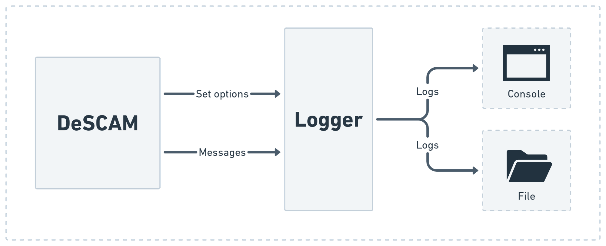
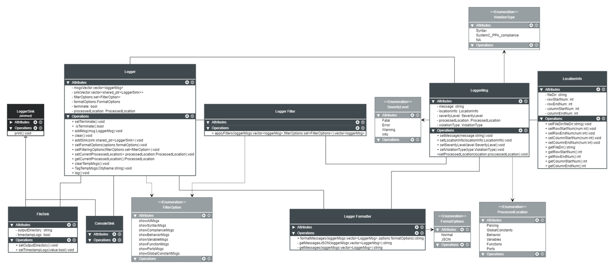

# Logger

DeSCAM's logger is a simple logging system that takes care of storing relevant information during the processing of SystemC-PPA models so that if something goes wrong, the stored information can be useful to help making the appropriate corrections. Additionally, the logger can sort, format and filter out specific messages to ease the analysis of the relevant information.

## Definitions

###### **Logger**:
Is a singleton class that is accessible to all classes of DeSCAM. It represents the interface to the logging system and acts as an entry point (source) for adding messages and setting the logging options.

###### **LoggerMsg**:
A class that bundles a message with its relevant attributes such as its severity level (info, warning or error), violation type (Syntax or SystemC-PPA compliance) and location information (File directory, line number, etc...,).

###### **LoggerFilter**:
Depending on the chosen filter options the LoggerFilter decides whether a LoggerMsg should be discarded or not by examining the attributes inside it.

###### **LoggerFormatter**:
Generates the final textual output from the stored instances of LoggerMsg in an easily readable format such as JSON.

###### **LoggerSink**:
Takes the formatted textual output and decided how it is going to be stored or processed. DeSCAM's logger has two types of sinks, a **ConsoleSink** that prints the output to the console and a **FileSink** that stores the logs in a timestamped file.

## The Logger Class Diagram

 

