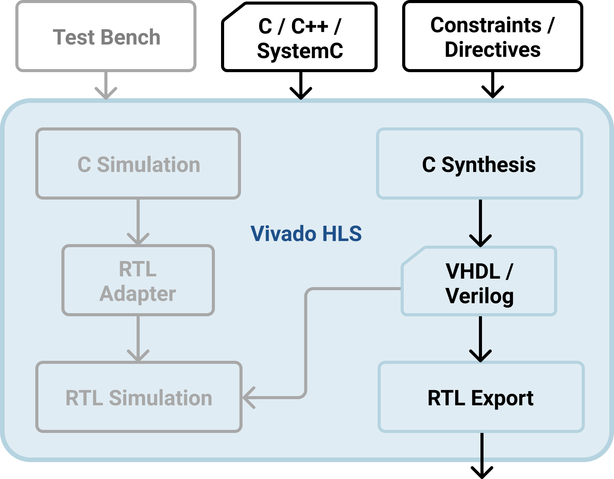

Automatic Generation of RTL Models using DeSCAM and Vivado HLS
-----

The purpose of this plugin is the automatic generation of RTL models using DeSCAM and 
Vivado HLS

####User Guide:

* Open the file **generate_model.sh** in the **Scripts** directory.
* Enter your paths for _DeSCAM_, _Vivado HLS_, _Onespin_ and _Python_ (Version 3.6+ is required)
* run **generate_model.sh**:

        ./generate_model.sh -f <myInputFile.> -o <myOutputDirectory> -t <sco or mco> --vivado_hls --onespin
* For more information run with -h or --help:

        ./generate_model.sh -h

* keep **check_hls_output.py** in the same directory as **generate_model.sh** if running with --vivado_hls option

The resulting folder structure looks like this:

```
├── Module1
│   ├── HLS
│   │   ├── directives
│   │   │   └── Module1_directives.tcl
│   │   ├── Module1.cpp
│   │   ├── Module1_data_Types.h
│   │   ├── Module1_functions.h
│   │   ├── hls_script
│   │   │   └── Module1_run_hls.tcl
│   │   ├── synthesis
│   │   │   └── ...
│   ├── Properties
│   │   ├── Module1_macros.vhi
│   │   ├── Module1_functions.vhi
│   │   └── Module1.vhi
│   └── RTL
│       ├── Module1_operations.vhd
│       ├── Module1_types.vhd
│       └── Module1.vhd
├── Module2
│   ├── ...
```

For each module a separate directory is created, which contains a folder for high level synthesis
files (HLS), property files (Properties) and RTL files (RTL). The HLS folder contains the files 
for the high level synthesis, one folder where the directives are stored, another folder where 
the script to run the high level synthesis is stored. The results of the high level synthesis are
written into the synthesis folder. Changes to the project can be made by loading the _synthesis_ 
folder as a project in Vivado HLS. This can also be done with the command `vivado_hls -p synthesis`.

The properties folder contains all files used for formal verification in onespin. The RTL folder contains
all VHDL files for the module.
 
 
Vivado HLS
----                                                       
                                                              
Vivado HLS is a well-known High Level Synthesis tool. The figure below shows the design flow of 
the tool. Vivado HLS synthesizes a C function, which can be written in C, C++ or SystemC. This 
function (Top Function) is the primary input for Vivado HLS and can contain a hierarchy of 
subfunctions. Another necessary input are the constraints, which contain information about the 
clock period, the clock uncertainty and a target FPGA. Furthermore, optional directives can be 
specified to control the synthesis process to achieve a certain behaviour or to optimize the RTL 
design.



There is the possibility to write C test benches and simulate the C functions before synthesis
and verify the RTL output using the C/RTL co-simulation. Since we are pursuing the Property 
Driven Development Design Flow in this thesis, verification by simulation will not be discussed 
in more detail.

The C-based source code, directives and constraints can be added interactively in a Vivado HLS 
project using the graphical user interface (GUI) or Tcl commands in the command prompt. 
Alternatively, Tcl scripts can be created and the commands executed in batch mode.

The primary output are RTL implementation files in hardware description language (HDL) formats, 
in the industry standard VHDL and Verilog. Vivado HLS packages the implementation files as an 
IP block for use with other tools in Xilinx Design Flow.

Vivado HLS also generates a synthesis report. The report provides details about performance and 
area of the RTL design. For example, information about the latency and initiation interval for 
the block and all sub-blocks instantiated in this block (respectively top function and 
sub-functions) are shown. The latency is the number of clock cycles required to generate the 
output. The Initiation Interval is the number of cycles before new inputs can be created 
(for designs without pipelining the initiation interval is one clock cycle greater than the 
latency). Furthermore there is a report about the required resources like memory, FIFOs, 
registers, multiplexers and expressions and an overview of the RTL ports with their respective 
protocols.

####Language Support

Vivado HLS supports many C, C++ and SystemC language constructs and is able to synthesize a 
large subset of modeling standard. However, there are some language constructs that are not 
supported by high level synthesis.

All data of an RTL design must be read from input ports or written to output ports, thus the 
C function must implement all functionality and must not depend on calls to system functions 
or the underlying operating system. Therefore, system calls such as _printf()_, 
_sleep()_, and so on, cannot be synthesized. But some of these functions are supported 
by the C simulation and can be used for debugging. These system calls are then ignored during 
the synthesis.

Since hardware has a fixed set of resources, dynamic memory allocation is not supported. All 
memory requirements have to be either outside the function scope or have fixed limits known at 
compile time. Furthermore, recursive functions cannot be synthesized. Many of the C++ Standard 
Template Libraries (STLs) use dynamic memory allocation or contain recursive functions. Therefore 
STLs are not supported by Vivado HLS.

####High-Level Synthesis C Libraries

The Vivado HLS C libraries enable easy design and function of common hardware modeled in C and
synthesized to RTL. For example, there are libraries for Digital Signal Processing, Linear 
Algebra, Video and Filter. One library that is frequently used in this work is the 
_Abitrary Precision Data Types Library_: C-based native data types are only on 8-bit 
boundaries. RTL on the other hand supports arbitrary lengths. For area optimization it is 
therefore crucial that we do not rely on the boundaries of native C data types. For example, 
if a 17-bit adder or multiplier is required, we should not be forced to use a 32-bit adder or 
multiplier. Vivado HLS provides both integer and fixed-point data types of arbitrary precision 
for C and C++, and supports the arbitrary precision data types of the SystemC library.

####Interfaces

With C-based designs, input and output operations are executed in zero time via function 
parameters. The same operations are performed in RTL designs through input and output ports 
using I/O protocols. When the top-level function is synthesized, the arguments are synthesized 
into RTL ports. This process is called _interface synthesis_. Vivado HLS creates three 
types of ports on the RTL design:

* **Clock and Reset Ports:** If the design takes more than one clock cycle to complete the 
operation, Vivado HLS generates a reset port (_ap\_rst_) and a clock port 
(_ap\_clk_) for the RTL design.
* **Block-Level Interface Protocol:**  By default, a block-level interface protocol is added 
to the design with the port _ap\_start_, _ap\_ready_, _ap\_done_ and 
_ap\_idle_. These signals control the block regardless of any port-level I/O protocols. 
* **Port-Level Interface Protocol:**  The port-level protocol created for each function 
argument and for the function return (except void) depends on the C type and its default 
protocol. For scalars, arrays, pointers and references there are different protocols for input 
and output arguments. Function arguments which are both read and written are split into an input 
and output port at RTL. 

####Directives

Vivado HLS offers the user several options for optimizing the design. _Directives_ can 
be used to control Vivado HLS to create a design that meets the desired performance and area 
goals. Thus, different implementations are possible for the same source description. For example, 
a loop can be unrolled for better latency or can be pipelined for better throughput. The 
_directives_ are prioritized differently during synthesis. Ensuring that performance 
(clock and throughput) is maintained has the highest priority. Afterwards the latency is minimized
and finally the area is minimized.

_Directives_ can either be inserted as pragmas directly into the source code or can 
be entered using directive script files. Both have their advantages: With the help of pragmas 
it is directly visible in the code where optimizations for the synthesis have been made. Script 
files can be used to create different designs without the need to change the code. Afterwards 
the different designs can be compared.

For more information see: [Vivado Design Suite User Guide](https://www.xilinx.com/support/documentation/sw_manuals/xilinx2019_2/ug902-vivado-high-level-synthesis.pdf)

Design Flow
-----------

####PPA to RTL Generation using HLS


The figure above illustrates the PPA to RTL Design Flow in combination with HLS. A plugin 
developed for the DeSCAM tool is used to generate the files. The PPA is used to get information 
about the behaviour of the module. The AST provides the information about the structure such as 
variables and ports.

The operations with all their commitments are generated as C++ files. Together with a Tcl script
generated by the DeSCAM tool or a manually written Tcl script containing the constraints and 
directives, the files act as input for the high level synthesis in Vivado HLS.

Also, a VHDL wrapper is generated, which is the interface to further modules or the outer world.
The wrapper contains the monitor, selecting the respective operation to be executed, and the 
control logic, which drives the operations module instantiated in the wrapper. Together with 
the VHDL files generated by Vivado HLS the wrapper forms the RTL module.

Optionally, properties can be generated in ITL format. These can be used to formally verify the
generated RTL design.

Since the strengths of HLS Tools particularly relate to scheduling and resource sharing, it 
should be possible to divide the execution of operations over several clock cycles. Whereas 
designs that require only one clock cycle for each operation and do not have a meaningful 
resource sharing over multiple clock cycles, the design must be created differently to avoid
overhead from the handshaking protocol and input register.

In the following we will call designs that allow multi-cycle opearations _MCO-Designs_ and 
designs that allow only single-cycle operations _SCO-Designs_. The differences in the designs 
will be explained in detail in the next chapters.

####VHDL Wrapper

Between the MCO-Design and the SCO-Design there are several differences in the implementation 
of the VHDL wrapper. Due to the condition that every operation in SCO-Designs must be completed
within one clock cycle, the wrapper is much less complex than the one for MCO-Designs. For 
example, the handshaking protocol and the input registers can be omitted.

#####MCO-Design

The basic structure of the VHDL wrapper is shown in the figure below. The monitor is an 
asynchronous process that contains the corresponding assumptions for each operation in 
combinational logic. These assumptions contain a number of boolean expressions, depending 
on the current state, state variables and inputs (including **sync** signals from Blocking and 
MasterSlave interfaces). If all assumptions of an operation are satisfied and the Operations 
Module is ready, a signal containing the active state is written to the input buffer. Wait 
operations are generated for blocking ports. If all assumptions for a wait operation are 
fulfilled the _wait_op_ signal is set to High, otherwise it is set to Low.

In MCO-Designs the operations may need several clock cycles. Reading and writing of inputs 
and outputs may be performed at different clock cycles during an operation. For this reason 
we have to store the input and output values in buffers. Although Vivado HLS offers the option
to use registers for the input and output ports, it is not possible to set a specific reset 
value for them. For this reason, we decided to buffer the values in the VHDL wrapper. The 
input values are written to input registers at the beginning of a new operation. For the 
outputs we apply the port-level interface protocol _ap_vld_ of Vivado HLS. Each output port 
of the operation module is given an additional port indicating whether the corresponding value 
is valid or not. If the valid port goes High, the corresponding value is stored in an output 
latch.
  


The notify signals use as output signals the port-level interface protocol _ap_vld_ and the 
values are stored in latches. Unlike the output signals, the register values are not directly 
connected to the notify outputs. To comply with the SystemC-PPA protocols, the notify signals 
are controlled by the block-level interface protocol. If the _done_ signal is High, the values 
of the notify registers are written to the outputs. If the _done_ signal is Low, all notify 
signals are Low. If the _idle_ signal is High, we are in a wait operation and the values of 
the notify registers are written to the outputs, except notify signals corresponding to 
**MasterOut** ports. The notify signal of the **MasterOut** port goes Low in a wait operation, 
because we assume that the corresponding slave module is always ready and the message was 
already transmitted in the previous operation. The next section shows the Block-Level Protocol 
in more detail. 

The current values of the state variables are required in both, the Monitor and the Operations 
Module. To avoid the creation of two registers, one input register and one register for the 
monitor, we use a multiplexer logic. The valid signals of a state variable output decides 
whether the value of the state variable registers or the corresponding _vars_out_ signal is 
written to the monitor. Additionally, if there is a new value for astate variable, the value 
is stored in the state variable register at the next clock cycle.

#####Block-Level Interface: Handshaking Protocol


The default block-level interface protocol **ap_ctrl_hs** is used for MCO-Designs. 
The figure shows a timing diagram of a sample transactions for the Handshaking Protocol 
Interface. After a reset, the block waits until the _start_ signal goes High and starts 
operating. The output signal _idle_ goes immediately Low to indicate that the block is no longer 
in idle state. Now _start_ must remain High until the _ready_ signal goes High. Once _ready_ 
goes High, there are two options: The _start_ signal remains High and the module starts the
next transaction or the _start_ signal goes Low and the design completes the current 
transaction and halt operation.

The input data is read at each clock cycle after the first cycle. The scheduling in Vivado HLS 
determines when the reading of an input occurs. The same applies to the writing of the output 
data. When the operation is completed, the output signal _done_ is asserted. This also 
indicates that the most recently written data is valid. For designs without pipelining, the 
_ready_ signal is asserted simultaneously with the _done_ signal.

In MCO-Designs, the operations module is controlled by the Control Logic using the Handshaking 
Protocol. After a reset, the _start_ signal is set to Low and the operations module stops the 
operation and goes into idle state. If the _reset_ signal is Low, the control logic checks at 
every clock cycle whether the _idle_ signal or the _ready_ signal is High. If so, there are 
two options: The Control Logic is informed by the monitor that the next operation is a 
wait operation. The _start_ signal is set to Low and the operations module goes into idle 
state.  If the monitor indicates to the control logic that the next state is not a 
wait operation, the _start_ signal is set to High and the operations module starts a new 
operation.

#####SCO-Design


The figure above shows the structure of VHDL wrappers for SCO-Designs, which is less complex 
compared to MCO-Designs. The outputs and the state variables are buffered in registers within 
the operation module.  Thus the outputs of the operation module can be passed straight through 
to the outputs of the wrapper and the port of the state variables can be directly connected to 
the monitor.

Since no handshaking protocol is necessary, the Control Logic only shifts the next state into 
the state register with each clock cycle. The monitor works the same way as in MCO-Designs, 
with the exception that no _wait_op_ signal is provided for wait operations. Since the 
operation module cannot be halted without the handshaking protocol, the operation module 
for SCO-Designs has an additional operation called _wait_operation_. During the 
_wait_operation_ the operation block retains all register values except for the notify 
signals of MasterOut ports, which are set to Low.

####Operations Module

The operation module is generated as C++ functions using DeSCAM. Again, a distinction is made 
between the SCO- and MCO-Design. In the following, the structure of the designs is explained 
using the example from the previous chapter.

#####MCO-Design

```
void Example_operations(
    // inputs
    msg_t b_in_sig,
    // outputs
    ap_int<32> &m_out_sig,
    bool &s_out_sig,
    // state variables
    msg_t &out_msg,
    ap_int<32> &out_cnt,
    Phase &out_nextPhase,
    // notify signals
    bool &b_in_notify,
    bool &m_out_notify,
    // operation selector
    operation active_operation
) {
    // operations
    switch (active_operation) {
    case state_1_1:
        // commitments of state_1_1
        cnt = 3;
        m_out_sig = 3;
        msg.data = b_in_sig.data;
        msg.status = b_in_sig.status;
        nextPhase = frame_start;
        s_out_sig = true;
        b_in_notify = false;
        m_out_notify = true;
        break;
    case state_1_2:
      (*...*)
    }
}
```

The code above shows the function that implements the operation module for MCO-Design. 
The top function of the shown design, which must be defined for each design, is the function 
_Example_operations_. Together with the control signals generated by block-level and port-level 
protocols, the function parameters form the interface to the outside world. Inputs are passed 
as values, outputs are passed by reference. The operation selector selects the active operation 
using a _switch case_ statement. Each operation contains a commitment list in which 
outputs, state variables and notify variables are assigned new values.

#####SCO-Designs
```
    void Example_operations(
      // inputs
      msg_t b_in_sig,
      // outputs
      ap_int<32> &m_out_sig,
      bool &s_out_sig,
      // state variables
      msg_t &out_msg,
      ap_int<32> &out_cnt,
      Phase &out_nextPhase,
      // notify signals
      bool &b_in_notify,
      bool &m_out_notify,
      // operation selector
      operation active_operation
    )
    {
      // output register
      static ap_int<32> m_out_sig_reg = 0;
      static bool s_out_sig_reg = false;
      // state variables register
      static msg_t msg_reg = {0, in_frame};
      static ap_int<32> cnt_reg = 0;
      static Phase nextPhase_reg = idle;
      // notify signal register
      static bool b_in_notify_reg = true;
      static bool m_out_notify_reg = false;

      // state variables temporary
      msg_t msg_tmp = msg_reg;
      ap_int<32> cnt_tmp = cnt_reg;
      Phase nextPhase_tmp = nextPhase_reg;
      // write register content to output
      m_out_sig = m_out_sig_reg;
      s_out_sig = s_out_sig_reg;
      out_msg = msg_reg;
      out_cnt = cnt_reg;
      out_nextPhase = nextPhase_reg;
      b_in_notify = b_in_notify_reg;
      m_out_notify = m_out_notify_reg;

      // operations
      switch (active_operation) {
      // commitments of state_1_1
      case state_1_1:
        cnt_reg = 3;
        m_out_sig_reg = 3;
        msg_reg.data = b_in_sig.data;
        msg_reg.status = b_in_sig.status;
        nextPhase_reg = frame_start;
        s_out_sig_reg = true;
        b_in_notify_reg = false;
        m_out_notify_reg = true;
        break;
      case state_1_2:
        (*...*)
      // commitments of wait_state
      case state_wait:
        m_out_notify_reg = false;
        break;
      }
    }
```

The code above shows the same design as the one for SCO-Designs. The structure is very similar 
to the one of MCO-Designs. The registers for outputs and state variables are not in the VHDL 
wrapper and must be implemented in the operation module. To model registers in Vivado HLS, 
static variables are used. Line 19 to Line 27 show the initialization of state variables and 
outputs with their respective reset values. 

In high level synthesis, the assignment of a static variable with a constant or variable is 
generated as a store operation and the assignment of a static variable to another variable is 
generated as a load operation. Both operations require one clock cycle each, so that one 
operation with a load instruction and a store instruction would result in a latency of two 
clock cycles. To get a latency of one clock cycle anyway, we use a trick and assign the values 
of the static variables to our outputs in advance of the _switch-case_ instruction 
(line 18 - 24). The outputs of the registers of the resulting RTL design are directly 
connected to the outputs of the operation module. This way only one store instruction and 
no load instruction is necessary and our design has only a latency of one clock cycle.

The assignments of an operation can all be executed in parallel, therefore they are not 
interdependent. In the High Level Synthesis description variables are dependent on previous 
assignments. For this reason temporary variables for state variables have been introduced, 
which are assigned the current value of the corresponding static variable at the beginning of 
the top function (Line 30-32). The assignments of the operations have static variables on the 
right hand side and temporary variables on the left hand side and are completely independent 
of each other. 

As mentioned in the previous section, the operations module has an additional wait operation 
(Line 42 - 44). The values of static variables are not changed in the wait operation. Only 
_notify_ variables for MasterOut ports are set to false.